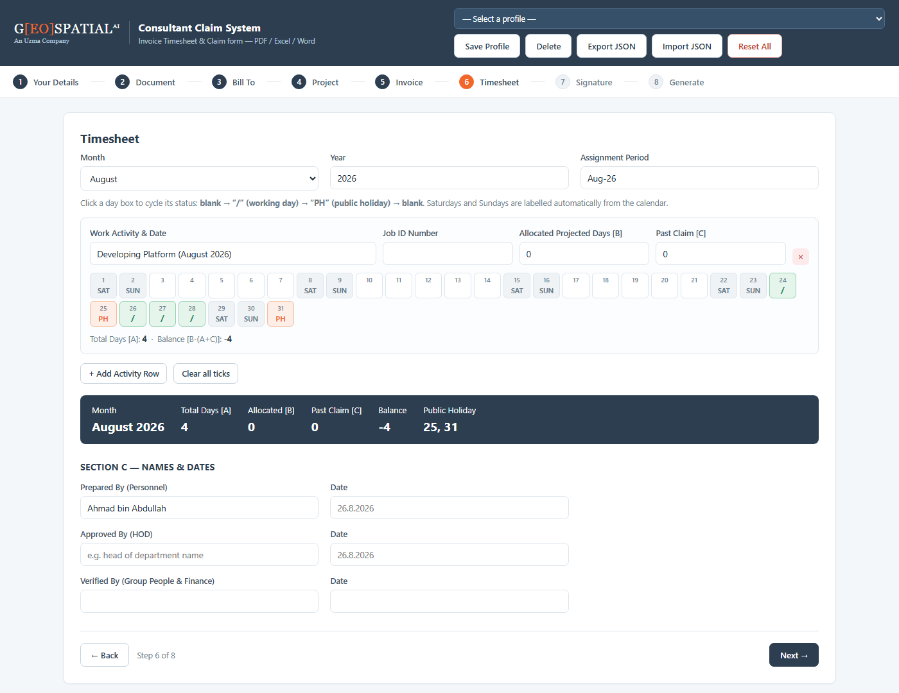
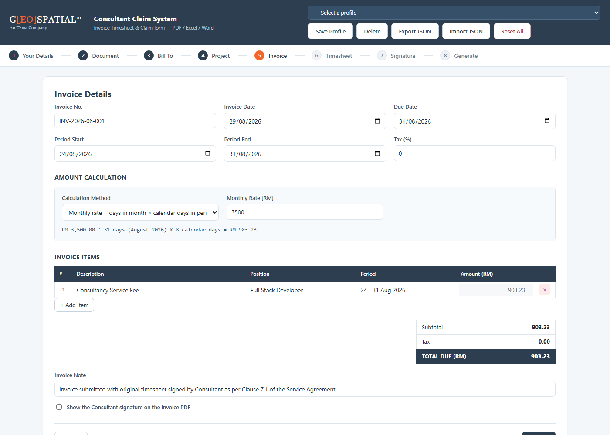

<div align="center">

# Consultant Claim System

**Invoice Timesheet &amp; Personnel Time Sheet generator · PDF · Excel · Word**
Fill the form once, tick the calendar, download all four documents.

[](https://github.com/kymy07/ConsultantClaimSystem/actions/workflows/ci.yml)
[]()
[]()
[]()


</div>

---

## Overview

A static web app for consultants who invoice monthly. Enter your details once, tick the days
you worked on a calendar grid, and the app generates the two documents finance asks for — in
four file formats — straight from the browser.

No server, no build step, no `npm install`, no internet connection. Every library is vendored
into `vendor/`, so the whole thing runs from a single folder on any machine.

---

## Documents Generated

| # | Document | Formats | Output file name |
|---|---|---|---|
| 1 | **Invoice Timesheet** | PDF · Excel | `INV-2026-08-026 - Name.pdf` / `.xlsx` |
| 2 | **Claim** — Uzma Personnel Time Sheet | PDF · Word | `Claim Aug 2026 - Name.pdf` / `.docx` |

Both PDFs are laid out to match the official templates: the invoice in portrait with the navy
header band, the time sheet in landscape with Sections A, B and C, the notes block and the
Uzma footer.

---

## The Flow

```
Step 1  Your details ──▶ Step 2  Pick a document ──┬─▶ A  Bill To → Invoice ─────────────┐
                                                   │                                     │
                                                   ├─▶ B  Project → Timesheet ───────────┤─▶ Signature ─▶ Generate
                                                   │                                     │
                                                   └─▶ A+B  Bill To → Project →          │
                                                            Invoice → Timesheet ─────────┘
```

| Choice | Steps you see | You get |
|---|---|---|
| **A** Invoice Timesheet | Bill To · Invoice · Signature · Generate | PDF + Excel |
| **B** Claim Form | Project · Timesheet · Signature · Generate | PDF + Word |
| **A + B** Both | all of the above, on one shared set of details | PDF + Excel + Word |

You cannot leave step 1 without a name, or step 2 without a choice; everything after that is
optional. The stepper at the top is clickable, so you can jump back and change your mind at
any point — picking a different document simply re-shapes the remaining steps.

Because the invoice period decides its own month, choosing **A** alone never asks you to touch
the timesheet. Choose **A + B** and setting the period pulls the timesheet to the same month —
unless you have already ticked days, in which case your ticks are left alone.



---

## Features

| | |
|---|---|
| 🧭 **Guided, branching flow** | Fill your details once, then pick **A** (Invoice), **B** (Claim) or **both** — the remaining steps rearrange so you only ever see the fields that document needs |
| 📅 **Tickable day grid** | Click a box to cycle `blank → / → PH`; Saturdays and Sundays are labelled from the real calendar, so you never tick a weekend by mistake |
| 🧮 **Three ways to price a period** | Monthly rate prorated by calendar days, daily rate × days ticked, or a fixed amount you type yourself — the live formula shows its working |
| ✍️ **Draw-or-upload signatures** | Three pads (Personnel, HOD, Verified By); blank space around the stroke is trimmed automatically before it is embedded |
| 🗂️ **Multiple activity rows** | Eight rows like the original form, each with its own Job ID, allocated days and past claim |
| 📊 **Totals that add up** | `TOTAL DAYS [A]`, `ALLOCATED [B]`, `PAST CLAIM [C]` and `BALANCE [B-(A+C)]` are computed per row and in aggregate |
| 💾 **Autosave + profiles** | Everything persists to `localStorage`; save one profile per consultant and switch between them |
| 📤 **Export / Import JSON** | Real backups you can move between machines — the only way data leaves the browser |
| 🧨 **Reset All** | Two-step confirmation, then every stored key is wiped and the app is empty again |
| 📱 **Responsive** | Collapses to a single column below 840px; the day grid wraps instead of scrolling |

---

## Tech Stack

**Frontend** — HTML5 · CSS3 (custom properties, grid, flexbox) · vanilla JavaScript (ES6+)
**PDF** — jsPDF 2.5.1 + jsPDF-AutoTable 3.8.2
**Excel** — ExcelJS 4.4.0
**Word** — docx 8.5.0
**Signatures** — signature_pad 4.1.7 · Canvas 2D
**Downloads** — FileSaver.js 2.0.5
**CI** — GitHub Actions (Node 20 · 22)

No bundler, no framework, no dependencies to audit at runtime.

---

## Project Structure

```
ConsultantClaimSystem/
├── index.html                    # the whole UI — eight wizard steps
├── assets/
│   ├── css/style.css             # design tokens + every component
│   ├── img/                      # brand artwork + README screenshots
│   └── js/
│       ├── state.js              # data model, formulas, localStorage
│       ├── logo.js               # brand artwork loading + vector fallbacks
│       ├── timesheet.js          # the 1–31 day grid
│       ├── signature.js          # signature pads + image trimming
│       ├── gen-invoice.js        # Invoice → PDF (jsPDF) + Excel (ExcelJS)
│       ├── gen-claim.js          # Claim   → PDF (jsPDF) + Word (docx)
│       └── app.js                # step flow, profiles, generate buttons
├── test/generate.test.js         # generates all four docs and checks them
├── vendor/                       # pinned libraries, committed for offline use
└── .github/workflows/ci.yml      # lint + tests on Node 20 & 22
```

---

## Getting Started

```bash
git clone https://github.com/kymy07/ConsultantClaimSystem.git
cd ConsultantClaimSystem
```

Then just double-click `index.html`. That is the whole setup.

To serve it over HTTP instead:

```bash
python -m http.server 8000
```

Then open <http://127.0.0.1:8000/>.

> **Serving over HTTP matters when more than one person shares a computer.** Opened from
> `file://`, Chrome treats every local file as one origin, so two copies of this folder under
> the same Windows account share the same `localStorage`. Over HTTP each URL gets its own
> origin and the data stays separate.

---

## How the Amount Is Calculated

Pick a method on the **Invoice** step; the formula line updates as you type.

| Method | Formula |
|---|---|
| **Monthly rate** (default) | `monthly rate ÷ days in month × calendar days in period` |
| **Daily rate** | `daily rate × days ticked "/"` |
| **Fixed amount** | whatever you type in the item table |

Worked example, matching a real invoice:

```
RM 3,500.00 ÷ 31 days (August 2026) × 8 calendar days (24–31 Aug) = RM 903.23
```

While the method is not *Fixed amount*, the first item's amount is read-only so it can never
drift out of step with the formula. Switch to **Fixed amount** to type your own.



---

## Branding & Logos

The site header, the footer and the Claim PDF all read their artwork from `assets/img/`:

| File | Used by |
|---|---|
| `logo-geospatial.png` (or `.jpg` / `.svg`) | site header + footer |
| `logo-uzma.png` (or `.jpg` / `.svg`) | top-right of the Claim PDF and Word file |

Drop either file in and it is picked up on the next reload — no code change. Until then the app
falls back to a **typographic recreation** of each wordmark, so nothing renders blank. The
fallbacks are approximations; use the official artwork for anything you actually submit.

Site colours come from the Geospatial AI wordmark and live as CSS custom properties in
`assets/css/style.css`:

```css
--navy:#2c3e50;   --navy-deep:#223140;   --orange:#f1662a;
```

The generated documents keep the colours of the official templates instead, so re-theming the
site never changes what finance receives.

---

## Data Storage

There is **no database and no server**. Everything lives in two `localStorage` keys:

| Key | Contents |
|---|---|
| `ccs.current` | the form currently open, autosaved every 250 ms |
| `ccs.profiles` | every profile saved via **Save Profile** |

Worth knowing:

- Data never leaves the browser on that computer.
- It is lost if you clear browsing data, switch browser or machine, or use a private window.
- The quota is roughly 5–10 MB; signatures (base64 PNG) take the most room. If the quota is
  exceeded the app raises a red warning instead of failing silently — export a JSON backup then.
- **Export JSON** is the only real backup. Use it before anything irreversible.

---

## Testing & CI

```bash
node test/generate.test.js
```

No `npm install`. The suite loads the application code into a Node VM behind a small browser
stub, generates all four documents, and asserts nine things — the invoice amount (RM 903.23),
`TOTAL DAYS [A]`, `BALANCE`, the automatic SAT/SUN labels, and the size plus magic bytes of
every generated file.

GitHub Actions runs it on every push across Node 20 and 22, alongside a JavaScript syntax
check, a vendored-library check, and a scan that fails the build if a real IC number or bank
account number ever lands in the repository.

---

## Editing Guide

<details>
<summary><b>Changing the theme</b></summary>

Every colour is a CSS custom property in the `:root` block at the top of `assets/css/style.css`:

```css
--navy:#1f3864;   --orange:#f26522;   --blue:#2e5c99;
--ink:#1b2330;    --muted:#6b7686;    --line:#dde3ec;
```

The PDF generators keep their own copies as RGB triples (`NAVY`, `BAR`, `LBL` in
`gen-invoice.js`), because jsPDF cannot read CSS. Change both if you re-brand.

</details>

<details>
<summary><b>Changing the Bill To company</b></summary>

The defaults live in `defaultState()` in `assets/js/state.js`:

```js
company: {
  name:  'Geospatial AI Sdn Bhd',
  regNo: '200901001789 (844716-P)',
  addr1: 'Uzma Tower, No 2, Jalan PJU 8/8A',
  addr2: 'Damansara Perdana, 47820 Petaling Jaya, Selangor'
}
```

Anything typed in the **Bill To** tab overrides them for the current form.

</details>

<details>
<summary><b>Adding a field to the form</b></summary>

Three places, in order:

1. `index.html` — add the `<label><input id="..."></label>`
2. `state.js` — add the key to `defaultState()` so it survives a reload
3. `app.js` — add `['element_id', 'section', 'key']` to the `FIELDS` array

`mergeDefaults()` backfills the new key for anyone with older saved data, so nothing breaks.

</details>

<details>
<summary><b>Adjusting the Claim form layout</b></summary>

`gen-claim.js` draws the time sheet with an explicit `y` cursor in millimetres on A4 landscape
(297 × 210). The vertical budget is tight — Section A, the day table, Section C, the notes and
the footer all have to fit on one page. If you add a row, take the height from `secH` or the
signature row rather than pushing the footer down.

</details>

<details>
<summary><b>Updating a vendored library</b></summary>

Drop the new UMD build into `vendor/` under the same file name and run the tests. The CI job
checks each expected file exists and is non-empty, so a rename will fail the build loudly
rather than silently break a download button.

</details>

---

## Contact

[](mailto:adlishah0821@gmail.com)
[](https://www.linkedin.com/in/adlishah-hakimi-56325223a/)
[](https://github.com/kymy07)

---

<div align="center">

**Adlishah Hakimi bin Sharilfuddin** · Malaysia

</div>
