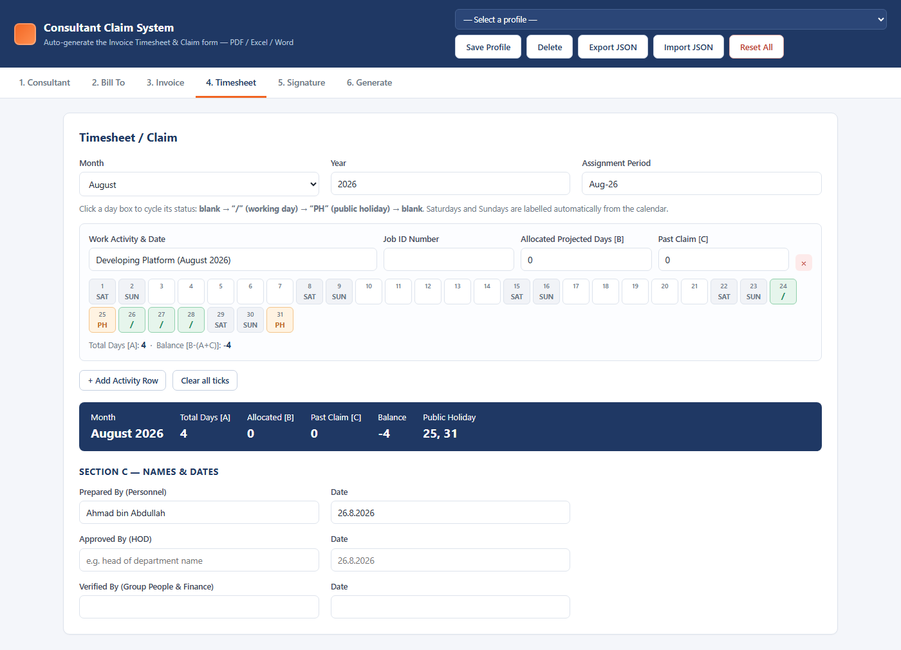
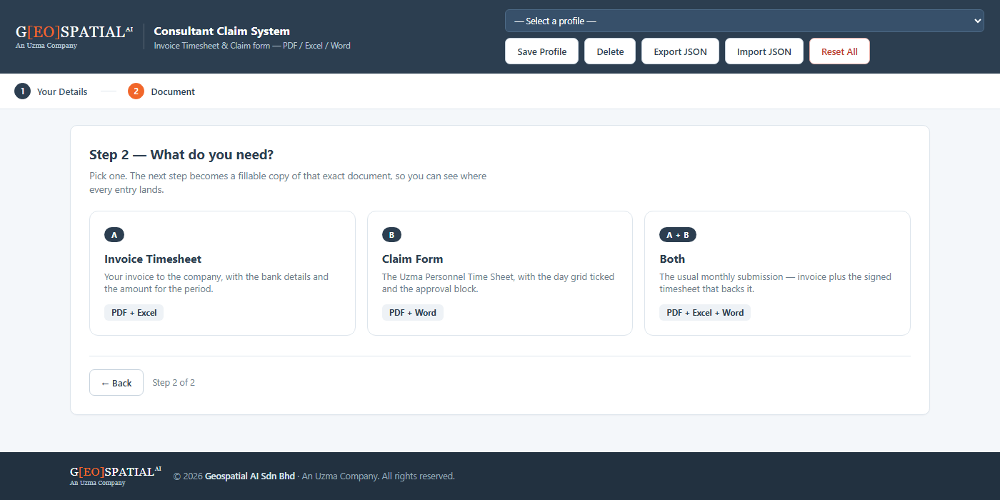
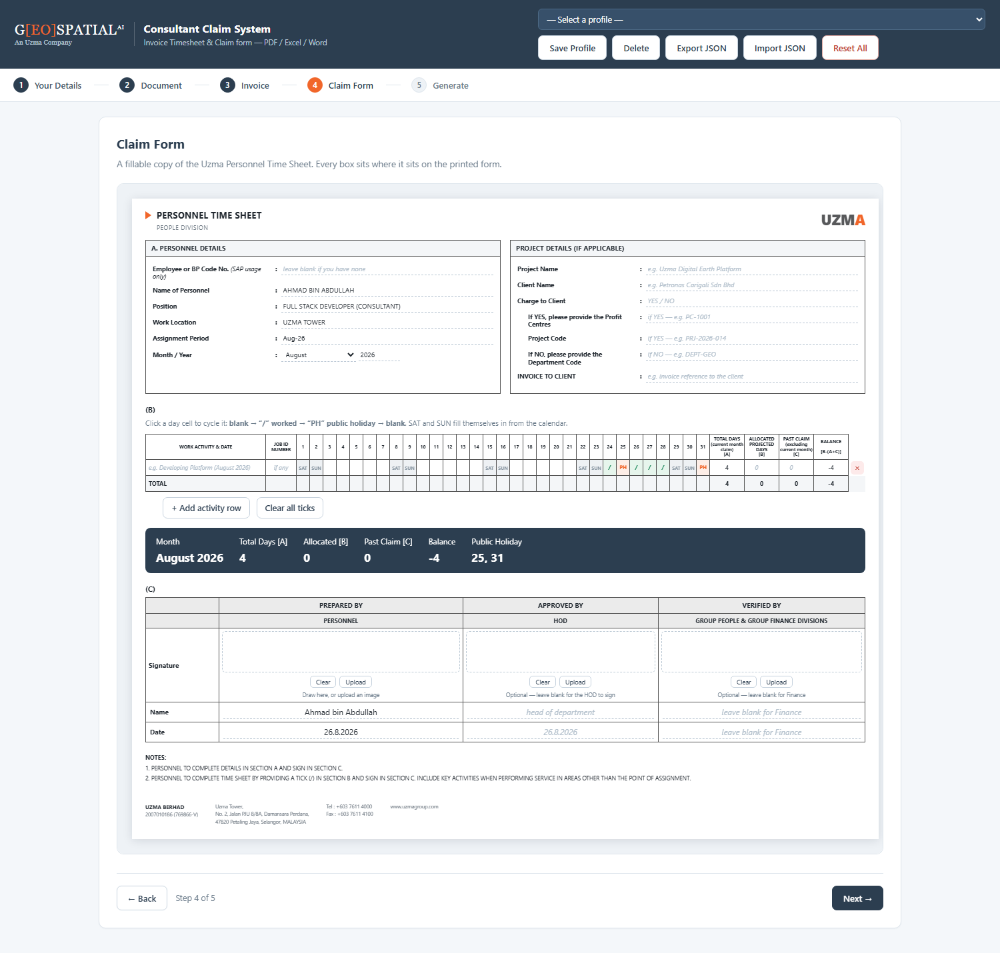

<div align="center">

# Consultant Claim System

**Invoice Timesheet &amp; Personnel Time Sheet generator · PDF · Excel · Word**
Fill the form once, tick the calendar, download all four documents.

[](https://kymy07.github.io/ConsultantClaimSystem/)
[](https://github.com/kymy07/ConsultantClaimSystem/actions/workflows/ci.yml)
[]()
[]()
[]()



</div>

---

## Overview

A static web app for consultants who invoice monthly. Enter your details once, tick the days
you worked on a calendar grid, and the app generates the two documents finance asks for — in
four file formats — straight from the browser.

No server, no build step, no `npm install`. Every library is vendored into `vendor/`, so the
whole thing runs from a single folder on any machine.

The one thing that needs the network is the front door: the app is opened by two named people
and asks them to sign in with their **BDOS** account. After that the session lasts 30 days and
the app works with the network unplugged.

---

## Documents Generated

| # | Document | Formats | Output file name |
|---|---|---|---|
| 1 | **Invoice Timesheet** | PDF · Excel | `INV-2026-08-026 - Name.pdf` / `.xlsx` |
| 2 | **Claim** — Uzma Personnel Time Sheet | PDF · Word | `Claim Aug 2026 - Name.pdf` / `.docx` |

Both PDFs are laid out to match the official templates: the invoice in portrait with the navy
header band, the time sheet in landscape with Sections A, B and C, the notes block and the
Uzma footer.

---

## Signing In

The app is for two people, so the door is a **BDOS** account
(`https://bdos.uzmadigitalearth.app`) plus a two-name allow-list in
[`assets/js/auth.js`](assets/js/auth.js):

```js
const ALLOWED_USERS = [
  'adlishah0821@gmail.com',
  'hanis.rashidan@uzmagroup.com'
];
```

| | |
|---|---|
| **Who checks the password** | BDOS. This app never sees, stores or transmits it anywhere else |
| **What comes back** | a JWT valid for **30 days**, kept in `localStorage` under `ccs.token` |
| **On every visit after** | the stored token opens the app immediately, and BDOS is asked to confirm it in the background |
| **Offline** | a valid token still opens the app — a dead network never locks you out |
| **Signing out** | discards the token; BDOS has no logout endpoint because the token is stateless |
| **Password resets** | there is no self-service reset — a BDOS administrator sets a new one |

The allow-list is applied twice: once to what was typed, and again to the address BDOS itself
confirms, so an account that is not on the list cannot get in with a valid password.

> **This gate says who is at the keyboard — it is not a lock on the data.** Everything it hides
> is HTML and JavaScript the browser has already downloaded, and anyone with the folder can
> open `index.html` directly. It is the right size of lock for a tool whose data never leaves
> your own browser; it is *not* what would protect a shared database. See
> [Data Storage](#data-storage).

---

## The Flow

```
Step 1  Your details ──▶ Step 2  Pick a document ──┬─▶ A    Invoice ───────────────┐
                                                   ├─▶ B    Claim Form ────────────┤──▶ Generate
                                                   └─▶ A+B  Invoice + Claim Form ──┘
```

| Choice | Steps you see | You get |
|---|---|---|
| **A** Invoice Timesheet | Invoice · Generate | PDF + Excel |
| **B** Claim Form | Claim Form · Generate | PDF + Word |
| **A + B** Both | Invoice · Claim Form · Generate | PDF + Excel + Word |

Step 3 onwards is not a form *about* the document — it **is** the document. The invoice step
draws the invoice with its navy band, BILL TO bar, item table and totals; the Claim step draws
the Uzma time sheet with Section A, the 31-column Section B grid and the Section C approval
block. Every entry sits exactly where it will print, and every empty box carries a hint of what
belongs in it, so nobody has to guess what goes where.



Your details from step 1 appear inside both documents and stay in sync: edit the name on the
invoice and step 1 updates too. You cannot leave step 1 without a name or step 2 without a
choice; everything after that is optional, and the stepper stays clickable so you can change
your mind at any time.

Because the invoice period decides its own month, choosing **A** alone never asks you to touch
the timesheet. Choose **A + B** and setting the period pulls the timesheet to the same month —
unless you have already ticked days, in which case your ticks win.



---

## Features

| | |
|---|---|
| 🔐 **BDOS sign-in** | Two named accounts, checked against the BDOS auth API; the 30-day session then opens the app offline |
| 🗄️ **Shared history, when BDOS offers it** | Profiles, the open draft and every generated claim go to the `cradle` database through BDOS &mdash; and the app works exactly as before when it cannot reach them |
| 🧭 **Guided, branching flow** | Fill your details once, then pick **A** (Invoice), **B** (Claim) or **both** — the remaining steps rearrange so you only ever see the document you asked for |
| 📄 **You fill the real document** | Steps 3 and 4 are pixel-shaped copies of the invoice and the Uzma time sheet, so every value is typed exactly where it prints |
| 💡 **A hint in every box** | Each blank carries an example of what belongs in it, and optional fields say so outright |
| 📅 **Tickable day grid** | Section B is the real 31-column table — click a cell to cycle `blank → / → PH → AL → UL`; Saturdays and Sundays label themselves from the calendar. `/` is a day worked and the only mark counted into TOTAL DAYS [A]; `PH`, `AL` (annual leave) and `UL` (unpaid leave) say why a day is not claimed |
| 🧮 **Three ways to price a period** | Monthly rate prorated by calendar days, daily rate × days ticked, or a fixed amount you type yourself — the live formula shows its working |
| ✍️ **Sign in the signature box** | The three pads (Personnel, HOD, Verified By) sit inside Section C where the pen would go; blank space around the stroke is trimmed before it is embedded |
| 🖋️ **Approval block starts filled** | Section C opens with the usual names and today's date already in place — every one is a normal field, so type over it when somebody else signs |
| 🏷️ **Official artwork, placed to the millimetre** | The Uzma wordmark ships with the app and is positioned from proportions measured off the printed form, not eyeballed |
| 👁️ **View before you download** | **View PDF** renders the finished document in the browser's own PDF viewer &mdash; check it, then download from inside the viewer or close and keep editing. Nothing reaches the disk until you say so |
| 🗂️ **Multiple activity rows** | Eight rows like the original form, each with its own Job ID, allocated days and past claim |
| 📊 **Totals that add up** | `TOTAL DAYS [A]`, `ALLOCATED [B]`, `PAST CLAIM [C]` and `BALANCE [B-(A+C)]` are computed per row and in aggregate |
| 💾 **Autosave + profiles** | Everything persists to `localStorage`; save one profile per consultant and switch between them. The profile list gives every profile its own row &mdash; the name opens that profile's details in the form, **Delete** removes that one, and **+ Add new profile** clears the form for another consultant |
| 📤 **Export / Import JSON** | Real backups you can move between machines — the only way data leaves the browser |
| 🧨 **Reset All** | Two-step confirmation, then every stored key is wiped and the app is empty again |
| 📱 **Responsive** | Collapses to a single column below 840px; the day grid wraps instead of scrolling |

---

## Tech Stack

**Frontend** — HTML5 · CSS3 (custom properties, grid, flexbox) · vanilla JavaScript (ES6+)
**PDF** — jsPDF 2.5.1 + jsPDF-AutoTable 3.8.2
**Excel** — ExcelJS 4.4.0
**Word** — docx 8.5.0
**Typeface** — Carlito (SIL OFL), metrically identical to Calibri
**Signatures** — signature_pad 4.1.7 · Canvas 2D
**Downloads** — FileSaver.js 2.0.5
**CI** — GitHub Actions (Node 20 · 22)

No bundler, no framework, no dependencies to audit at runtime.

---

## Project Structure

```
ConsultantClaimSystem/
├── index.html                    # the whole UI — the document replicas live here
├── assets/
│   ├── css/style.css             # design tokens + every component
│   ├── img/                      # logo-uzma.png + README screenshots
│   └── js/
│       ├── auth.js               # the BDOS sign-in gate + allow-list
│       ├── sync.js               # profiles / draft / claims → the cradle DB, via BDOS
│       ├── state.js              # data model, formulas, localStorage
│       ├── logo.js               # brand artwork loading + vector fallbacks
│       ├── timesheet.js          # Section B — the 31-column day grid
│       ├── signature.js          # in-form signature pads + image trimming
│       ├── gen-invoice.js        # Invoice → PDF (jsPDF) + Excel (ExcelJS)
│       ├── gen-claim.js          # Claim   → PDF (jsPDF) + Word (docx)
│       ├── preview.js            # the on-screen PDF viewer
│       └── app.js                # step flow, profiles, generate buttons
├── docs/
│   └── BDOS-CCS-Endpoints.md     # the storage API this app asks BDOS for
├── test/
│   ├── page.test.js              # markup + stylesheet: what a fake DOM cannot see
│   ├── auth.test.js              # who may sign in, and what happens next
│   ├── sync.test.js              # the database sync, and how it degrades
│   └── generate.test.js          # generates all four docs and checks them
├── vendor/                       # pinned libraries, committed for offline use
│   ├── carlito.js                # the Calibri-metric typeface, subset for this form
│   └── Carlito-OFL.txt           # its licence
└── .github/workflows/ci.yml      # lint + tests on Node 20 & 22
```

---

## Getting Started

The app is live on GitHub Pages — nothing to install:

**<https://kymy07.github.io/ConsultantClaimSystem/>**

It runs entirely in your browser there too: nothing is uploaded, everything stays in that
browser's `localStorage`. To keep a copy on your own machine instead:

```bash
git clone https://github.com/kymy07/ConsultantClaimSystem.git
cd ConsultantClaimSystem
```

Then just double-click `index.html`. That is the whole setup.

To serve it over HTTP instead:

```bash
python -m http.server 8000
```

Then open <http://127.0.0.1:8000/>.

> **Serving over HTTP matters when more than one person shares a computer.** Opened from
> `file://`, Chrome treats every local file as one origin, so two copies of this folder under
> the same Windows account share the same `localStorage`. Over HTTP each URL gets its own
> origin and the data stays separate.

---

## How the Amount Is Calculated

Pick a method on the **Invoice** step; the formula line updates as you type.

| Method | Formula |
|---|---|
| **Monthly rate** (default) | `monthly rate ÷ days in month × calendar days in period` |
| **Daily rate** | `daily rate × days ticked "/"` |
| **Fixed amount** | whatever you type in the item table |

Worked example, matching a real invoice:

```
RM 3,500.00 ÷ 31 days (August 2026) × 8 calendar days (24–31 Aug) = RM 903.23
```

While the method is not *Fixed amount*, the first item's amount is read-only so it can never
drift out of step with the formula. Switch to **Fixed amount** to type your own.

Long values wrap rather than collide: an address wider than its column continues on the next
line and pushes the block down, instead of running into the Period column beside it.

The address is typed as two lines because it prints as two, so **Address (Line 1)** holds only
what the invoice can print on one — 66 mm, which is 46 characters at the 8.5 pt the invoice is
set in, measured with the PDF's own metrics. Type past that and the overflow moves to the front
of line 2 with the caret, breaking between words and never inside one, so you carry on typing
where the words went. `splitAddressLines()` in `state.js` holds the rule.

---

## Branding & Logos

The site header, the footer and the Claim PDF all read their artwork from `assets/img/`:

| File | Used by | Status |
|---|---|---|
| `logo-uzma.png` (or `.jpg` / `.svg`) | top-right of the Claim page, PDF and Word file | **ships with the app** |
| `logo-geospatial.png` (or `.jpg` / `.svg`) | site header + footer | drop yours in |

Drop a file in and it is picked up on the next reload — no code change. Where one is missing the
app falls back to a **typographic recreation** of that wordmark, so nothing renders blank. The
fallbacks are approximations; use the official artwork for anything you actually submit.

### Matching the printed sheet

Every value below was read out of the reference PDF itself — its font table and its own
drawing operators — or out of the Excel workbook it is printed from, rather than matched by
eye. The sheet prints to one scale in both directions, so a length taken from the workbook is
carried over as a share of the content width and holds on our A4 landscape page too:

| | Value | Where it came from |
|---|---|---|
| Typeface | Calibri / Calibri Bold | the PDF's embedded font table |
| Panel and header fills | `#F2F2F2` | the fill operator behind Section A, the day table head and Section C |
| Arrow and footer rule | `#ED7D31` | Office's *Orange, Accent 2* |
| Arrow size | 0.899 % × 0.909 % of the content width | 6.137 × 6.200 pt on a 682.32 pt sheet |
| Footer rule | 0.585 pt wide, 2.657 % of the content width tall | a stroked line, not a bar |
| Section C columns | 15.224 %, 27.458 %, 28.500 %, 28.817 % of the content width | the workbook's column breaks — C→K, K→Y, Y→AN, AN→BB |
| Section C rows | 34, 34, 80.15, 30 and 30 pt on a 1655.25 pt sheet | its row heights, heading rows through Date |
| Gap above Section C | 3.746 % of the content width | the four empty rows (62 pt) between the grid and (C) |
| `Project Code` | no rule under it | its cell, AY15:BB15, is the one field on the form with no bottom border |

Two of those are easy to get wrong by drawing what looks like a table. The label column is
**open** beside the two heading rows — the box starts at `PREPARED BY`, and the space to its
left is where the `(C)` marker sits, not a grey cell. And `Project Code` shares its line with
the profit centres but carries no rule of its own.

The Uzma wordmark is a separate matter: it is an image on the reference sheet, and its own
orange is `#F26522` — a different colour from the form's `#ED7D31`. Both are correct; they are
different things. The typographic fallback in `logo.js` keeps the brand orange.

**On the typeface.** The sheet is an Excel document set in Calibri, and a PDF that is not set
in Calibri does not read as the same form. Calibri belongs to Microsoft and cannot be shipped
in a public repository, so the app embeds **Carlito** — an open-licensed face drawn to be
metrically identical. Every glyph carries the same advance width, checked against the Calibri
on a Windows machine across both weights, so lines break and columns fill exactly as in the
original. It is subset to Latin-1, Latin Extended-A and the punctuation this form actually
meets, which brings two weights down from 1.3 MB to 240 kB.

Two deliberate differences remain. The reference is **US Letter** landscape and this app
renders **A4**, because A4 is what comes out of a Malaysian printer; every measurement above is
a fraction of the content width, so the proportions survive the change. And the day grid labels
*every* weekend in the month, not only those inside the claimed period — that is the app
filling the sheet in for you, and it is why the ticks are worth checking before you download.

### Placing the Uzma mark

Supplied artwork carries its own padding — the Uzma PNG is a 270 × 92 canvas around a wordmark
that is only 228 × 41, and the margin is not symmetric. Sized by that canvas, the mark prints at
roughly half scale and sits off-centre. So `loadLogo()` crops the transparent margin before
handing the image on, and every caller measures the mark itself.

The header then places it from proportions taken off the printed time sheet rather than from
guesswork:

| | Reference form (Letter landscape) | This app (A4 landscape) |
|---|---|---|
| Mark width | 58.57 pt — **8.583 %** of the content width | 8.583 % |
| Right edge | **0.725 %** of that width inside the margin | 0.725 % |
| Vertical | a shade below the centre of the orange arrow | same |

Because both are fractions of the content width, the header lands in the same place on A4 as it
does on the original Letter-size form, and the PDF, the Word file and the on-screen Claim page
all size the mark identically.

Site colours come from the Geospatial AI wordmark and live as CSS custom properties in
`assets/css/style.css`:

```css
--navy:#2c3e50;   --navy-deep:#223140;   --orange:#f1662a;
```

The generated documents keep the colours of the official templates instead, so re-theming the
site never changes what finance receives.

---

## Data Storage

The app has no server of its own, and it never holds a database password &mdash; a static page
downloaded by a browser has nowhere to hide one. Everything it stores by itself lives in
`localStorage`:

| Key | Contents |
|---|---|
| `ccs.current` | the form currently open, autosaved every 250 ms |
| `ccs.profiles` | every profile saved via **Save Profile** |
| `ccs.token` | the BDOS session token (30 days) |
| `ccs.user` | the signed-in name and email, to greet you and to re-check the allow-list |

Worth knowing:

- Data never leaves the browser on that computer.
- It is lost if you clear browsing data, switch browser or machine, or use a private window.
- The quota is roughly 5–10 MB; signatures (base64 PNG) take the most room. If the quota is
  exceeded the app raises a red warning instead of failing silently — export a JSON backup then.
- **Export JSON** is the only real backup while the shared database is not yet in place.

### The shared database

Beyond the browser, the app is written to keep three things in the **`cradle`** PostgreSQL
database &mdash; **shared profiles**, **the draft you have open**, and **a history of every claim
generated** &mdash; so the two accounts see each other's work and nothing is lost when a browser
is cleared.

A browser cannot speak to PostgreSQL: it is a TCP wire protocol, not HTTP, and a public static
app could not be trusted with the password anyway. So the database stays behind BDOS, which
already authenticates these users, and the app reaches it over the same API as the sign-in.
The endpoints this needs are specified in
[`docs/BDOS-CCS-Endpoints.md`](docs/BDOS-CCS-Endpoints.md) &mdash; six routes under `/ccs/`, the
table shapes behind them, and the server-side allow-list that has to be enforced there rather
than here.

| Data | Where | Who sees it |
|---|---|---|
| Profiles | `ccs.profiles` | both accounts |
| The open draft | `ccs.drafts` | just you |
| Generated claims | `ccs.claims` | both accounts |

**Until BDOS deploys those routes, none of this is on.** [`sync.js`](assets/js/sync.js) probes
once at sign-in; a `404`, a `403` or an unreachable server turns syncing off for the session
without a word, and the app saves to `localStorage` exactly as it always has. That is also what
happens on a plane. Nothing in the app ever waits on a sync response, so a slow or broken
database cannot interrupt somebody filling in a form.

When a draft is found in the database, it is adopted only when it cannot cost you anything:
silently if the form on screen is untouched, and otherwise only after asking, and only when the
stored draft is demonstrably newer than the last one this browser sent up. Work on your screen
wins by default.

---

## Testing & CI

```bash
node test/page.test.js        # 11 checks — the markup and the stylesheet
node test/auth.test.js        # 29 checks — the sign-in gate
node test/sync.test.js        # 31 checks — the database sync
node test/generate.test.js    # 15 checks — the four documents
```

No `npm install`, and nothing touches the network. Three of the suites load the application
code into a Node VM behind a small browser stub.

`generate.test.js` produces all four documents and checks both the arithmetic — the invoice
amount (RM 903.23), `TOTAL DAYS [A]`, `BALANCE`, the automatic SAT/SUN labels — and the files
themselves: size and magic bytes for each, that the Claim PDF really embeds Carlito, and that
the Invoice PDF does *not*, since it is not set in Calibri and should not carry a face it never
draws with. It also pins the template's grey and orange, so a change to either fails loudly
rather than quietly shipping a form that no longer matches the one finance receives.

`auth.test.js` puts a fake BDOS and a fake browser behind the gate — no network call, no real
password — and pins the rules that matter: only the two listed accounts get in, the address
BDOS confirms overrules the one typed, an expired token is dropped rather than trusted, a
valid one opens the app even with the network down, and signing out leaves nothing behind.

`page.test.js` is the odd one out: it reads `index.html` and `style.css` as text, because the
two worst bugs this app has had were invisible to a stubbed DOM. An overlay that sets its own
`display` beats the browser's `[hidden]{display:none}`, so `el.hidden = true` did nothing and
the sign-in gate sat over the unlocked app forever; and a form whose submit listener never
bound fell back to a native GET, putting a password in the URL. In a fake DOM both of those
pass. So this suite asserts that every overlay has its `[hidden]` rule, that the sign-in form
cannot submit natively, and that the scripts load in a workable order.

`sync.test.js` runs the sync against a stub BDOS, and its first assertion is the one that
matters most today: with the endpoints returning 404, syncing switches off, one probe is sent
and nothing else, and the app is left exactly as it was. It then checks that a draft is adopted
only when no work can be lost, that profiles converge in both directions, and that a recorded
claim carries the month as 1&ndash;12 rather than the 0&ndash;11 the form uses internally.

GitHub Actions runs all four on every push across Node 20 and 22, alongside a JavaScript syntax
check, a vendored-library check, and a scan that fails the build if a real IC number or bank
account number ever lands in the repository.

---

## Editing Guide

<details>
<summary><b>Changing the theme</b></summary>

Every colour is a CSS custom property in the `:root` block at the top of `assets/css/style.css`:

```css
--navy:#1f3864;   --orange:#f26522;   --blue:#2e5c99;
--ink:#1b2330;    --muted:#6b7686;    --line:#dde3ec;
```

The PDF generators keep their own copies as RGB triples (`NAVY`, `BAR`, `LBL` in
`gen-invoice.js`), because jsPDF cannot read CSS. Change both if you re-brand.

</details>

<details>
<summary><b>Changing who can sign in</b></summary>

The list is one array at the top of `assets/js/auth.js`:

```js
const ALLOWED_USERS = [
  'adlishah0821@gmail.com',
  'hanis.rashidan@uzmagroup.com'
];
```

Addresses are compared lower-case and trimmed, so case and stray spaces do not matter. Anyone
added here still needs a BDOS account — registration is invite-only, so ask a BDOS
administrator for a one-time PIN first. `test/auth.test.js` asserts the list is exactly two
names long; update that expectation when you add a third.

</details>

<details>
<summary><b>Changing the Bill To company</b></summary>

The defaults live in `defaultState()` in `assets/js/state.js`:

```js
company: {
  name:  'Geospatial AI Sdn Bhd',
  regNo: '200901001789 (844716-P)',
  addr1: 'Uzma Tower, No 2, Jalan PJU 8/8A',
  addr2: 'Damansara Perdana, 47820 Petaling Jaya, Selangor'
}
```

Anything typed in the **Bill To** tab overrides them for the current form.

</details>

<details>
<summary><b>Adding a field to the form</b></summary>

Three places, in order:

1. `index.html` — add the `<label><input id="..."></label>`
2. `state.js` — add the key to `defaultState()` so it survives a reload
3. `app.js` — add `['element_id', 'section', 'key']` to the `FIELDS` array

`mergeDefaults()` backfills the new key for anyone with older saved data, so nothing breaks.

</details>

<details>
<summary><b>Changing who approves Section C</b></summary>

Section C opens pre-filled so the common case needs no typing. The starting values live in
`SIGN_DEFAULTS` at the top of `assets/js/app.js`, and `fillDefaultsForMonth()` applies them
**only to fields that are still empty** — so nothing you have already typed is ever overwritten:

```js
const SIGN_DEFAULTS = {
  hod:      '…',   // the approver whose name appears under APPROVED BY
  verified: ''     // Group People & Finance sign on paper, so this stays blank
};
```

`PREPARED BY` follows your name from step 1, and both dates default to today. All six are
ordinary fields on the Claim page: type over any of them when a different person signs.

</details>

<details>
<summary><b>Adjusting the Claim form layout</b></summary>

`gen-claim.js` draws the time sheet with an explicit `y` cursor in millimetres on A4 landscape
(297 × 210). The vertical budget is tight — Section A, the day table, Section C, the notes and
the footer all have to fit on one page. If you add a row, take the height from `secH` or the
signature row rather than pushing the footer down.

Section C is not free-hand: `C_EDGE`, `C_ROW` and `C_GAP` at the top of the file hold its
column breaks, row heights and the gap above it as shares of the content width, straight from
the workbook. Change those and the PDF and the Word copy move together.

</details>

<details>
<summary><b>Rebuilding the Carlito subset</b></summary>

`vendor/carlito.js` is generated, not hand-written. To rebuild it — after adding a language
that needs more glyphs, say:

```bash
pip install fonttools
curl -sLO https://cdn.jsdelivr.net/gh/googlefonts/carlito@main/fonts/ttf/Carlito-Regular.ttf
curl -sLO https://cdn.jsdelivr.net/gh/googlefonts/carlito@main/fonts/ttf/Carlito-Bold.ttf

pyftsubset Carlito-Regular.ttf --unicodes="U+0020-007E,U+00A0-017F,U+2013,U+2014,U+2018,U+2019,U+201C,U+201D,U+2022,U+2026,U+20AC,U+2122" --layout-features='*' --no-hinting --desubroutinize
```

Base64 the result and drop it into the `REGULAR` and `BOLD` strings. Keep it as concatenated
string chunks — a raw newline inside a JavaScript string literal is a syntax error, and the
whole file is one `<script>`, so that mistake takes the app down with it.

Do **not** substitute Microsoft's `calibri.ttf`. It renders identically, but this repository is
public and the font is not redistributable.

</details>

<details>
<summary><b>Updating a vendored library</b></summary>

Drop the new UMD build into `vendor/` under the same file name and run the tests. The CI job
checks each expected file exists and is non-empty, so a rename will fail the build loudly
rather than silently break a download button.

</details>

---

## Contact

[](mailto:adlishah0821@gmail.com)
[](https://www.linkedin.com/in/adlishah-hakimi-56325223a/)
[](https://github.com/kymy07)

---

<div align="center">

**Adlishah Hakimi bin Sharilfuddin** · Malaysia

</div>
